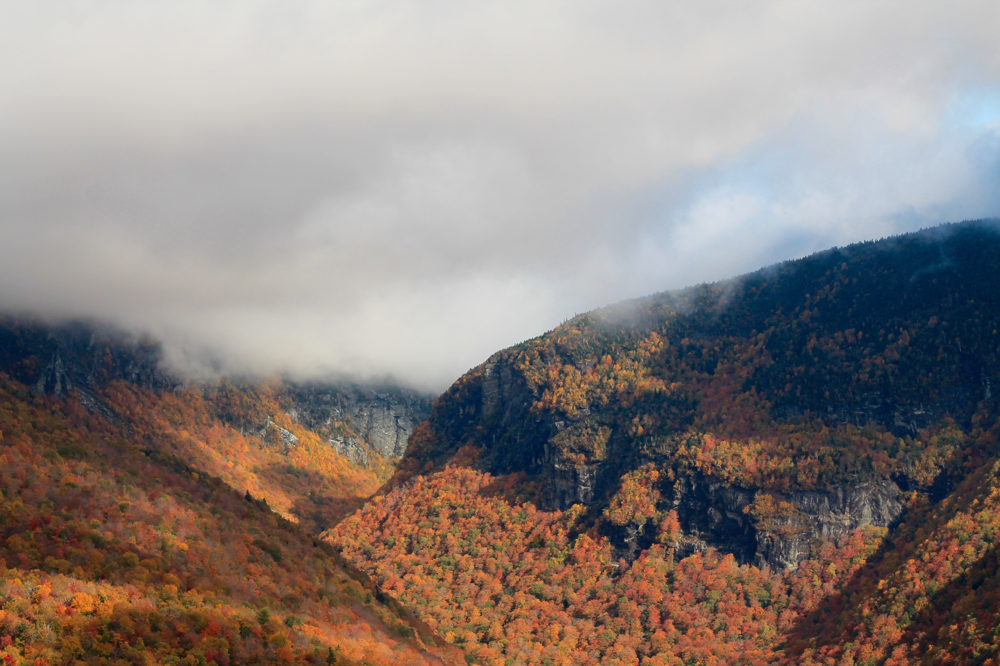
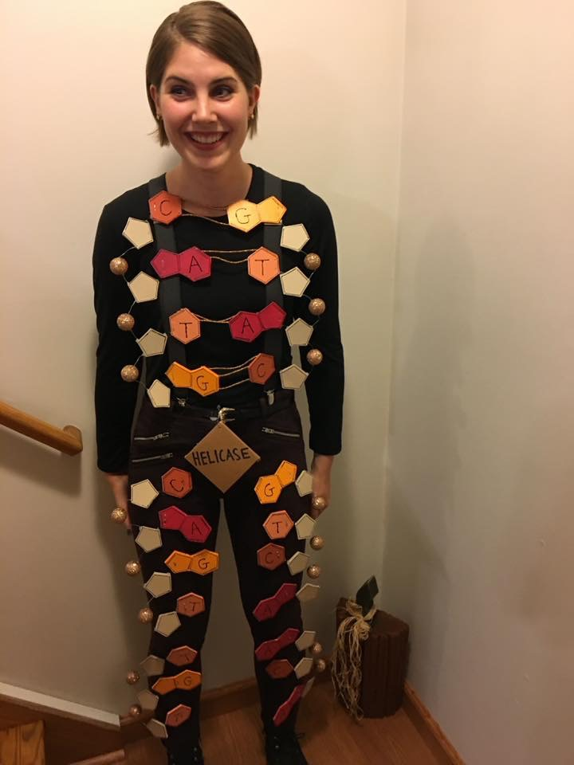

 

#### Brittany Verrico

* Affiliation: Plant Biology Department, University of Vermont 
* Email: bverrico@uvm.edu 

  

## Useful links:
* [R markdown cheatsheet](https://www.rstudio.com/wp-content/uploads/2015/02/rmarkdown-cheatsheet.pdf)
* [Course Webpage](https://gotellilab.github.io/Bio381/) 
* [Github website templates](https://github.com/jekyll/jekyll/wiki/Themes) 
* [Class Notebook](https://github.com/BMVerrico/Bio381_ComputationalBiology/blob/master/LabNotebook.Rmd)

## Table of Contents: Homework Assignments
* [Homework 1: ](#id-section1)
* [Homework 2: ](#id-section2)
* [Homework 3: ](#id-section3)
* [Homework 4: ](#id-section4)
* [Homework 5: ](#id-section5)
* [Homework 6: ](#id-section6) 
* [Homework 7: ](#id-section7)
* [Homework 8: ](#id-section8)
* [Homework 9: ](#id-section9)
* [Homework 10: ](#id-section10)
* [Homework 11: ](#id-section11)

------

### Week 1:

[Webpage]([https://bmverrico.github.io/Bio381_ComputationalBiology/#id-section1)

[GitHub]([https://github.com/BMVerrico/)

------

### Week 2:    

[Path analyses](pathAnalysis1.html)

------

### Week 3: 

[Beamer Slides](Homework3.pdf)

------

### Week 4:    

[Homework 4 R code](Homework4.html)

------

   
### Week 5: 
   
[Homework 5 Regular Expressions](Homework5.html)

------

   

### Week 6: 

------

### Week 7: 

------

### Week 8:  

------

### Week 9: 

------

### Week 10:    

------

### Week 11: 