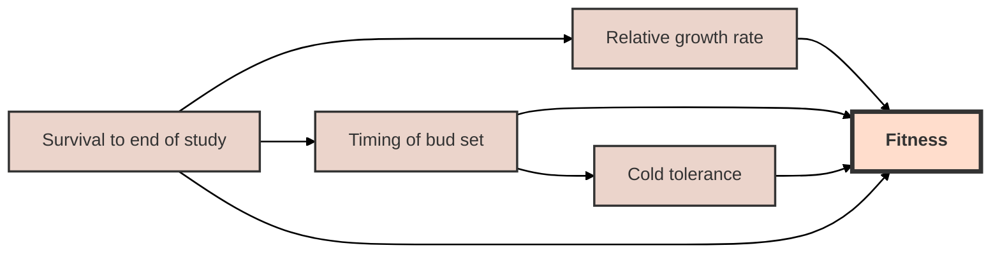
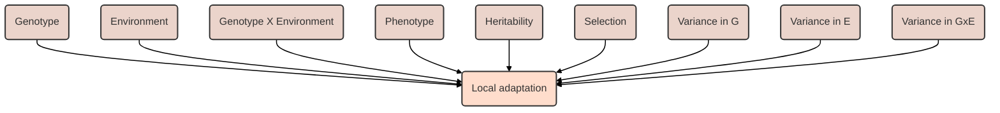

Project overview (rought draft...):

Fundamental theory indicates that at fine spatial scales gene flow has the potential to completely overwhelm divergent selection and local adaptation. That is, unless an isolating mechanism presents a barrier to the homogenizing effects of gene flow (Richardson et al. 2014). Strong selection that brings the population mean closer to a local optimal phenotype can allow for microgeographical adaptation, which is local adaptation occurring within the dispersal neighborhood of the population (Richardson et al. 2014). 

Objective 1: Determine if red spruce located along altitudinal gradients are locally adapted.

Hypothesis 1: Fitness depends on the site origin of the family, and fitness decreases as geographical and climatic differences increase from the site origin. 

Prediction 1: Families are adapted to the local optimal and the mode of fitness is highest at the site origin. 

Local adaptation can be formally defined as a genotype having a higher fitness in its native site than another genotype introduced to that site. That is to say, the performance of a genotype is correlated with environmental conditions at the population origin. Fitness is how good a particular genotype is at contributing to the gene pool in the next generation relative to other genotypes. Fitness is often relative and really is related to survival and reproduction. 

Fitness is difficult to measure in trees because they are long-lived, so it is common to use different phenotypic metrics to estimate relative fitness. There are several traits that I can feasible measure in the field that relate to fitness. These traits include relative growth rate, timing of bud set, and cold tolerance. Here is the description of the relationship between the traits.

Another thing to consider is the different factors that affect local adaptation. This is me just thinking outloud...not sure if this is completely correct. 

Objective 2: Ascertain the implications of climate change on the potential for adaptive evolution in red spruce located along the altitudinal gradient.

Hypothesis 2:

Prediction 2:

NEED TO FINISH THIS!