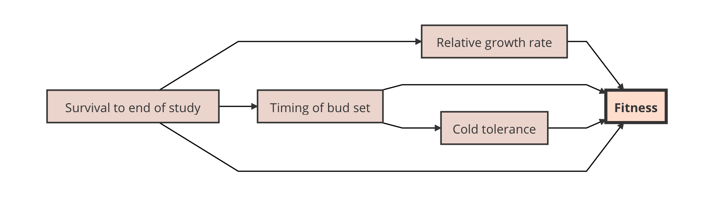
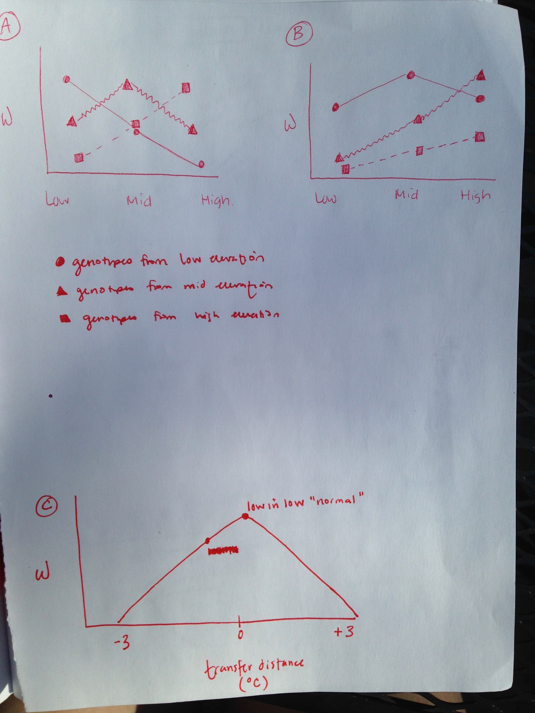

Homework 2: Path analysis

Fundamental theory indicates that at fine spatial scales gene flow has the potential to completely overwhelm divergent selection and local adaptation. That is, unless an isolating mechanism presents a barrier to the homogenizing effects of gene flow (Richardson et al. 2014). Strong selection that brings the population mean closer to a local optimal phenotype can allow for microgeographical adaptation, which is local adaptation occurring within the dispersal neighborhood of the population (Richardson et al. 2014). 

Objective 1: Determine if red spruce located along altitudinal gradients are locally adapted.

Hypothesis 1: Fitness depends on the site origin of the family, and fitness decreases as geographical and climatic differences increase from the site origin. 

Prediction 1: Families are adapted to the local optimal and the mode of fitness is highest at the site origin. 

Local adaptation can be formally defined as a genotype having a higher fitness in its native site than another genotype introduced to that site. That is to say, the performance of a genotype is correlated with environmental conditions at the population origin. 

Fitness is difficult to measure in trees because they are long-lived, so it is common to use different phenotypic metrics to estimate relative fitness. There are several traits that I can feasibly measure in the field that relate to fitness. These traits include relative growth rate, timing of bud set, and cold tolerance. Here is the description of the relationship between the traits.

Early graphs showing local adaptation of low, mid, and high elevation individuals. Figure A: Low elevation genotypes are represented by circles, mid genotypes by triangles, and high genotypes by squares. X axis: elevation groups (discrete). Y axis: fitness (w). At each elevation, the native genotype has the highest fitness. Figure C: What local adaptation could look like if elevation was not treated as a discrete variable. In order to do this, the transfer distance (or the distance in environment or climate) between each individual tree and the location of the common garden should be calculated. For example (as seen in Figure C), a tree native to low elevation sites still has the highest fitness in a low elevation common garden. The transfer distance is 0, or rather close to zero, because the mean annual temperature (for example) that this tree experiences is the same as the common garden location.

Objective 2: Ascertain the implications of climate change on the potential for adaptive evolution in red spruce located along the altitudinal gradient.

Figure B: Same descriptions for the axes as in Figure A. There is a "mix-match" in the optimal fitness and elevation. For example, as temperatures warm, the low elevation trees have highest fitness in mid elevation, the mid elevation trees have highest fitness in high elevation (this could also remain mid elevation), and the high elevation trees have a reduced fitness overall, but still display local adaptation to the native site.