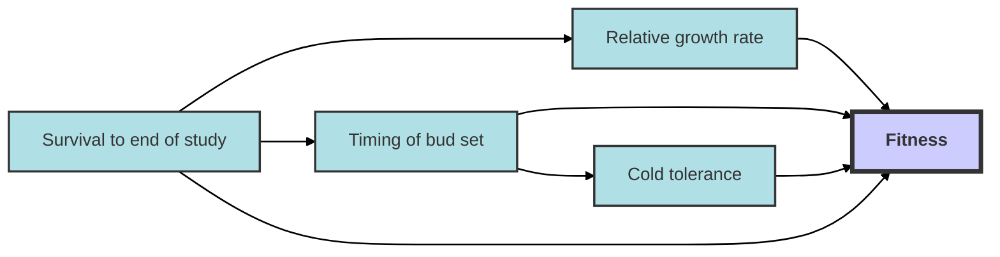

Description of path analysis:

need to add!

```mermaid
graph LR;
A[Survival to end of study]
A --> B[Relative growth rate]
A --> C[Timing of bud set]
C --> D[Fitness]
A --> D[<b>Fitness]
B --> D
C --> E[Cold tolerance]
E --> D

linkStyle default stroke-width:1.5px, fill:none, stroke:black
style A fill:#B0E0E6,stroke:#333,stroke-width:2px;
style B fill:#B0E0E6,stroke:#333,stroke-width:2px;
style C fill:#B0E0E6,stroke:#333,stroke-width:2px;
style D fill:#ccf,stroke:#333,stroke-width:4px;
style E fill:#B0E0E6,stroke:#333,stroke-width:2px;
```
